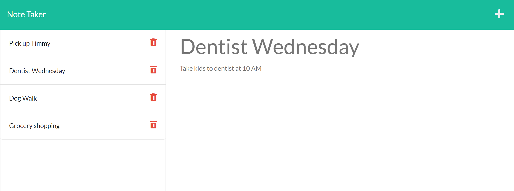
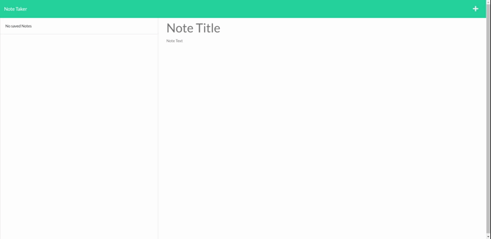

# Note-Taker

  
## Table Of Contents
  - [Motivation](#Motivation)
  - [Tools-Utilized](#Tools-Utilized)
  - [Installation](#Installation)
  - [Usage](#Usage)
  - [License](#License)
  - [Contribution](#Contribution)
  - [Tests](#Tests)
  - [Questions](#Questions)
  - [Credits](#Credits)
  
## Motivation

The motivation for this project is to provide users with a convenient and efficient way to record tasks/notes for later refernce. Being provided the front-end code for this project, my main objective is to write the backend and create a connection between the front and backend.

In completing this project, I have learned the basic concepts of Express.js. I have also learned the benefits of utilizing modular routes to maintain cleaner code. 

* DEPLOYED THROUGH HEROKU https://enigmatic-meadow-33307.herokuapp.com/

## Video Demonstration

## Tools Utilized

## Installation

This application requires no installations to use. Acces to web browseer is all that is required.

## Usage

User will open application on web and be prompted to write a title of their task under note title section and then a brief description of the task under note text section. When finished writing the note, user can then save the note and reference it later on the left side of the website. When the note is no longer needed, user can then delete it from the list.

## License
    
Licensed under the [ISC](https://opensource.org/licenses/ISC) license

## Contribution

Provide any suggestions to the email listed below.

## Tests

To run this application, tests are not required.

## Questions

*Any questions please contact me through email*

cwalk280@yahoo.com

## Credits

Resources of significance:

Special thanks to Ileriayo Adebiyi https://github.com/Ileriayo/markdown-badges#testing and Lucas Himsel https://gist.github.com/lukas-h/2a5d00690736b4c3a7ba for their public library of common badges

